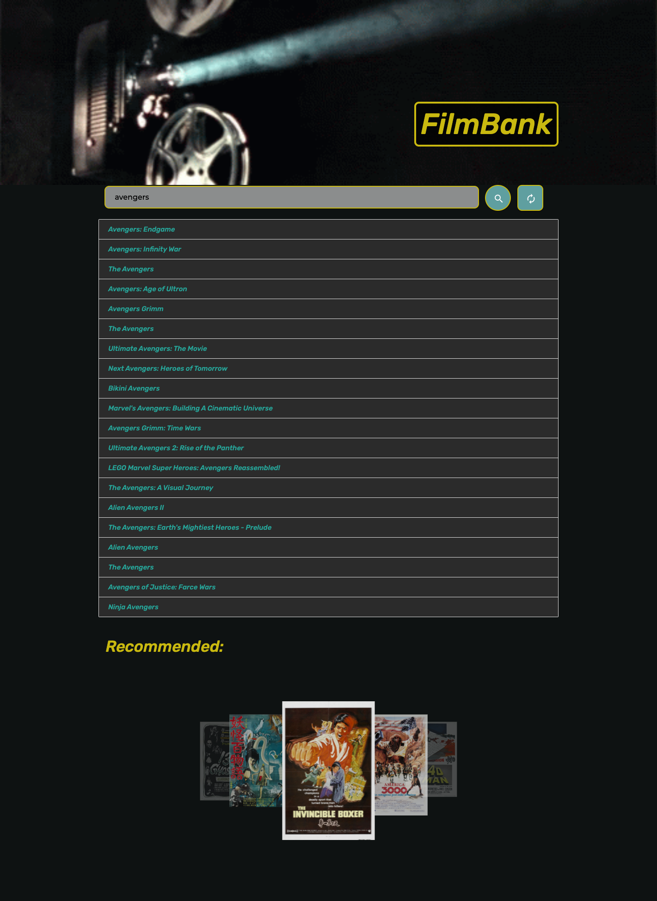
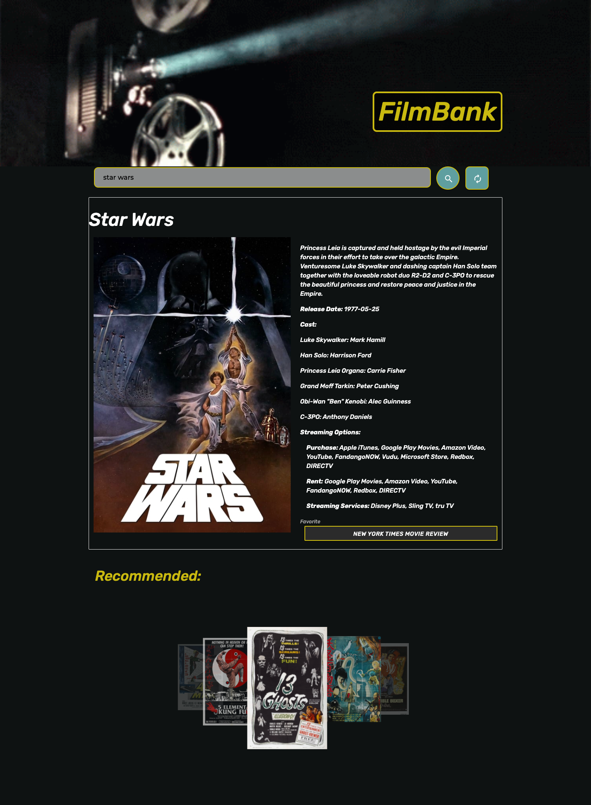

# FilmBank

FilmBank is an application that gives a user the ability to search for movies, get a description, including plot, cast, release date, where it's streaming, and the New York Times movie review.

Future development includes allowing users to create a profile whereby they can save lists, write reviews and follow one another. 

---
## Developers

   * Joey Castillo (joeycastilloo558@gmail.com) 
   * Lisa Goodell (robotsinboxes@gmail.com)
   * Yihsien Lu (alecfirstapple@gmail.com)
   * Scott Willrich (swillrich@gmail.com)

---

## Link to Deployed Application

https://robotsinboxes.github.io/FilmBank/


---
## User Story

```
GIVEN that I am interested in information about a particular film,
WHEN I search for a film
THEN I see the poster and basic information about the film.
WHEN I want to find where a file is streaming
THEN I see a listing of streaming providers
```

---
## Application Images


Movie Search Results




Selected Movie 



---


## Technologies in Use

FilmBank was built using:

  * HTML 
  * Materialize CSS 
  * css 
  * Animate.css
  * JavaScript, 
  * The Movie Database API (https://developers.themoviedb.org/3/getting-started/introduction)
  * The New York Times Moview Review API (https://developer.nytimes.com/docs/movie-reviews-api/1/overview)


